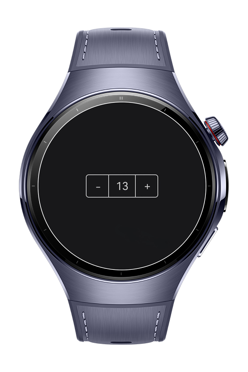

> **Note:** To access all shared projects, get information about environment setup, and view other guides, please visit [Explore-In-HMOS-Wearable Index](https://github.com/Explore-In-HMOS-Wearable/hmos-index).

# How To Make Counter Crown

CounterCrown is a HarmonyOS Next wearable app that demonstrates how to use the digital crown (the side round button on the watch) to interact with UI components. By rotating the crown, users can increment or decrement a counter in real time.

This project is a minimal but practical example showing how to capture and handle onDigitalCrown events in ArkTS with ArkUI.


# Preview
 

# Use Cases

- Rotate the crown to increase or decrease the counter.

# Tech Stack

**Languages**: ArkTS, TypeScript

**Frameworks**: HarmonyOS SDK 5.1.0(18)

**Tools**: DevEco Studio Vers 5.1.0.842

**Libraries**:  @kit.ArkUI


# Directory Structure

```
entry/src/main/ets/
├── pages
└──    Index.ets
```

# Constraints and Restrictions

### Supported Devices

- Huawei Watch 5

# License

**CrownCounter** is distributed under the terms of the MIT License.

See the [LICENSE](/LICENSE) for more information.